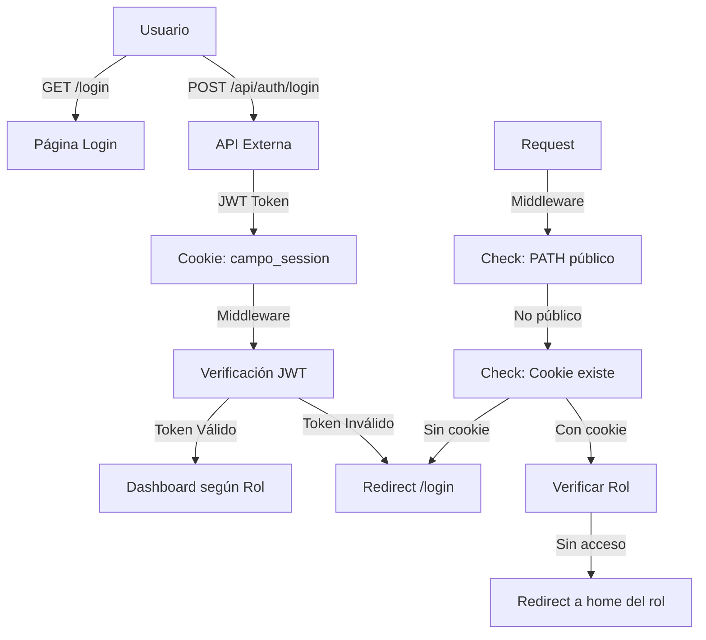

# Análisis de Estructura y Riesgos - Web Administrativa SADERH

## Resumen Ejecutivo

He realizado un análisis exhaustivo de tu aplicación web administrativa. El proyecto es una aplicación **Next.js 15** con autenticación JWT, manejo de roles y una arquitectura que delegan las API a un backend externo. A continuación se detallan los hallazgos y riesgos identificados.

---

## 1. Estructura del Proyecto

### 1.1 Distribución de Rutas

```
app/
├── (auth)/                    # Rutas públicas de autenticación
│   ├── login/
│   ├── forgot-password/
│   ├── reset-password/
│   └── dev-panel/            # ⚠️ Panel de desarrollo en producción
│
├── (dashboard)/              # Rutas protegidas
│   ├── layout.tsx            # Layout principal con sidebar
│   ├── admin/                # Rol: SUPER_ADMIN
│   │   ├── dashboard/
│   │   ├── usuarios/
│   │   ├── beneficiarios/
│   │   ├── asignaciones/
│   │   ├── reportes/
│   │   └── configuracion/
│   │
│   ├── coordinador/          # Rol: COORDINADOR
│   │   ├── dashboard/
│   │   ├── asignaciones/
│   │   ├── bitacoras/
│   │   ├── reportes/
│   │   └── tecnicos/
│   │
│   └── notificaciones/
│
components/
├── layout/
│   └── Sidebar.tsx           # Navegación con control de roles
├── dashboard/
│   └── StatsCard.tsx
└── tables/
    └── DataTable.tsx
```

### 1.2 Sistema de Roles

| Rol | Permisos |
|-----|----------|
| `SUPER_ADMIN` | Acceso completo: dashboard, usuarios, beneficiarios, asignaciones, reportes, configuración |
| `COORDINADOR` | Dashboard, asignaciones, bitácoras, reportes, gestión de técnicos |
| `TECNICO` | Vista limitada (no aparece en el sidebar del admin actual) |

---

## 2. Hallazgos de Seguridad

### 🔴 Riesgos Críticos

#### 2.1 Código Duplicado en Middleware
**Archivo:** [`middleware.ts`](middleware.ts:81-96)

El middleware contiene código duplicado desde la línea 81 hasta la 96, lo cual genera un comportamiento inesperado y posibles errores de runtime.

```typescript
// ⚠️ Este código está DUPLICADO
export const config = {
  matcher: [
    "/((?!_next/static|_next/image|favicon.ico|logo|icons).*)",
  ],
};
```

**Recomendación:** Eliminar las líneas duplicadas 81-96.

---

#### 2.2 Server Actions con Orígenes Abiertos
**Archivo:** [`next.config.ts`](next.config.ts:16)

```typescript
experimental: {
  serverActions: { allowedOrigins: ["*"] },  // ⚠️ PELIGROSO
}
```

**Riesgo:** Permite que cualquier dominio ejecute Server Actions, facilitando ataques CSRF y SSRF.

**Recomendación:** Especificar orígenes permitidos:
```typescript
serverActions: { allowedOrigins: ["campo-saas.vercel.app", "localhost:3000"] }
```

---

#### 2.3 Credenciales Expuestas en Archivo de Ejemplo
**Archivo:** [`.env.local.example`](.env.local.example:10-25)

Las credenciales de ejemplo estánhardcodeadas y visibles en el repositorio:
- `JWT_SECRET`, `JWT_SECRET_APP`, `JWT_SECRET_ADMIN`
- `DATABASE_URL` (PostgreSQL de Neon)
- `CLOUDINARY_API_KEY`, `CLOUDINARY_API_SECRET`
- `SUPERADMIN_PASSWORD`

**Recomendación:** Usar solo variables sin valores por defecto y documentar las requeridas.

---

### 🟠 Riesgos Altos

#### 2.4 Ausencia de Rate Limiting
No se encontró implementación de rate limiting para:
- Intentos de login
- Peticiones API
- Envío de notificaciones/correos masivos

**Riesgo:** Vulnerabilidad a ataques de fuerza bruta y DoS.

---

#### 2.5 Manejo Inseguro de Errores
**Archivos:** 
- [`UsuariosClient.tsx`](app/(dashboard)/admin/usuarios/UsuariosClient.tsx:69)
- [`ConfiguracionClient.tsx`](app/(dashboard)/admin/configuracion/ConfiguracionClient.tsx:100)

```typescript
// ⚠️ Uso de alert() - expuesta información sensible
alert(error?.message ?? "No se pudo crear el usuario");
```

**Riesgo:** Información de errores internos expuesta al usuario.

---

#### 2.6 Recarga de Página Completa
**Archivos:** Múltiples componentes cliente

```typescript
// En UsuariosClient.tsx, ConfiguracionClient.tsx
window.location.reload();  // ⚠️ Mala práctica
```

**Riesgo:** Pérdida de estado, mala experiencia de usuario, posible exponibilidad de datos en memoria.

---

#### 2.7 Dependencia Externa Sin Validación
**Archivo:** [`next.config.ts`](next.config.ts:27-35)

```typescript
async rewrites() {
  if (appMode === "web" && externalApiUrl) {
    return {
      beforeFiles: [{
        source: "/api/:path*",
        destination: `${externalApiUrl}/api/:path*`,
      }],
    };
  }
}
```

**Riesgo:** 
- Sin validación de respuestas del backend externo
- Sin manejo de errores de conexión
- Man-in-the-middle si el backend externo es compromiseado

---

### 🟡 Riesgos Medios

#### 2.8 IDs de Zona Hardcodeados
**Archivo:** [`UsuariosClient.tsx`](app/(dashboard)/admin/usuarios/UsuariosClient.tsx:391-402)

```typescript
<option value="1">Zona Norte</option>
<option value="2">Zona Sur</option>
<option value="3">Zona Centro</option>
// ...
```

**Riesgo:** Acoplamiento fuerte, los IDs deben venir del backend.

---

#### 2.9 Falta de Validación de Entrada en Formularios
Los formularios (creación de usuarios, configuraciones) no muestran:
- Validación en tiempo real
- Límites de caracteres
- Sanitización de inputs

---

#### 2.10 Ausencia de Tabla de Auditoría Activa
Aunque existe el schema [`auditoria`](lib/schema.ts:163-176) en la base de datos, no se encontró implementación de logging de acciones de usuarios.

---

#### 2.11 Panel de Desarrollo Accesible
**Archivo:** [`app/(auth)/dev-panel/`](app/(auth)/dev-panel/)

El panel de desarrollo está en las rutas de producción sin protección visible.

---

## 3. Riesgos de Arquitectura

### 3.1 Diagrama de Flujo de Autenticación



### 3.2 Problemas Arquitectónicos Identificados

| Problema | Impacto | Severidad |
|----------|---------|-----------|
| API completamente externalizada | Sin control de validación, logging, ni seguridad perimetral | Alto |
| Sin caché implementado | Posible sobrecarga del backend externo | Medio |
| Estado cliente mediante reload | Mala UX, posible pérdida de datos | Medio |
| Sin separaciones de entornos | Configuración de producción en desarrollo | Bajo |

---

## 4. Recomendaciones Prioritarias

### Inmediatas (Esta Semana)

1. **Corregir middleware.ts** - Eliminar código duplicado líneas 81-96
2. **Restringir Server Actions** - Cambiar `allowedOrigins: ["*"]` a dominios específicos
3. **Ocultar credenciales** - Eliminar valores por defecto de `.env.local.example`
4. **Implementar Rate Limiting** - Usar middleware de Next.js o servicio externo

### Corto Plazo (Este Mes)

5. **Reemplazar `alert()`** - Usar componentes de toast (sonner ya está instalado)
6. **Eliminar `window.location.reload()`** - Usar router.refresh() de Next.js
7. **Implementar auditoría** - Loggear acciones críticas (crear usuario, modificar configuraciones)
8. **Validar respuestas API** - Crear wrapper para manejar errores del backend externo

### Mediano Plazo (Próximo Trimestre)

9. **Traer API locally** - Considerar mover lógica de API a Next.js para mayor control
10. **Implementar caché** - Usar unstable_cache o Redis para datos frecuentes
11. **Mejora de formularios** - Agregar validación con Zod (ya está instalado)
12. **Separar entornos** - Configuración específica por ambiente

---

## 5. Resumen de Archivos Críticos a Revisar

| Archivo | Líneas | Problema |
|---------|--------|----------|
| [`middleware.ts`](middleware.ts) | 81-96 | Código duplicado |
| [`next.config.ts`](next.config.ts) | 16 | Server Actions sin restricción |
| [`.env.local.example`](.env.local.example) | 10-25 | Credenciales expuestas |
| [`UsuariosClient.tsx`](app/(dashboard)/admin/usuarios/UsuariosClient.tsx) | 69, 81 | Alert y reload |
| [`ConfiguracionClient.tsx`](app/(dashboard)/admin/configuracion/ConfiguracionClient.tsx) | Múltiples | Alert, reload, manejo de errores |

---

## 6. Dependencias y Vulnerabilidades

### Paquetes Críticos
- **Next.js 15.1.0** - Versión reciente, revisar advisories
- **React 19** - Versión muy reciente, posible incompatibilidad con librerías
- **jose** - Para JWT, revisar versión y vulnerabilidades

### Recomendación de Auditoría
Ejecutar `npm audit` o `pnpm audit` para verificar vulnerabilidades conocidas.

---

*Documento generado el 5 de marzo de 2026*
*Análisis realizado en modo Arquitecto*
